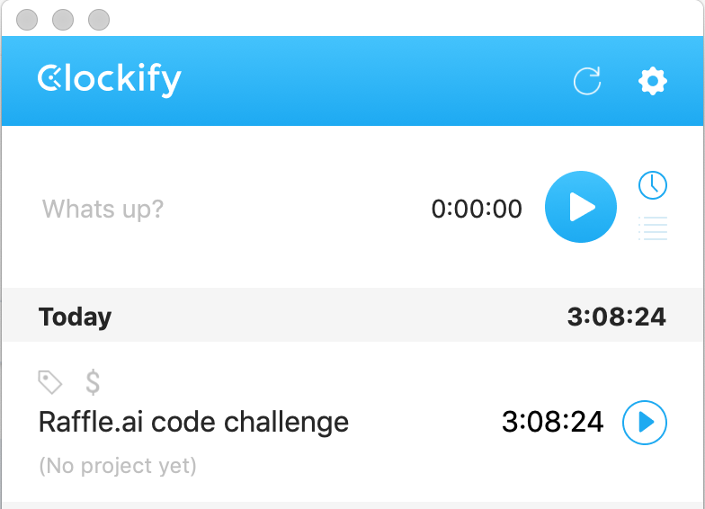

This project was created for the Raffle.ai code challenge.

## Project layout
### React Application and it's packages:
        ⁃	React - CRA
        -   React-router
            https://reactrouter.com/web/guides/quick-start
        -   React-Redux
            https://react-redux.js.org/
        -   Redux-Thunk
            https://github.com/reduxjs/redux-thunk
        -   React-Toast-Notifications
            https://github.com/jossmac/react-toast-notifications
        -   Formik
            https://formik.org/
        -   React-modal
            https://www.npmjs.com/package/react-modal
        -   UUID
            https://www.npmjs.com/package/uuid
        ⁃	Blueprintjs
            https://blueprintjs.com/
        -   Tailwind.css
            https://tailwindcss.com/

## For Logging in:
    -   username: Admin
    -   password: secretPassword

But can be whatever is configured in /utils/credentials.js

## Steps
# Before I got started I wrote a list of steps to follow in order to complete the challenge within the time limit

here's a link to the file: https://docs.google.com/document/d/1QiLOtkLmI_lbSczq3iTJbyaS-7LVk48zgyjkwtOqeLE/edit?usp=sharing

Time:

## Issues

    -   After adding an item to the list, when you try to add a new one it fills out the form with the values of the previous one. It should only do that when you edit -> unfortunately I ran out of time so could not fix the issue.
    -   The application also needs proper styling

## Possible additional features

    -   Input field above the list -> to filter
    -   Maybe having predefined filters, or some other type of sorting of sorting (i.e. priority)
        

## Available Scripts

In the project directory, you can run:

### `yarn install or npm install`

To install dependencies, before you run the project.

### `yarn start`

Runs the app in the development mode. 
Open [http://localhost:3000](http://localhost:3000) to view it in the browser.

